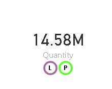
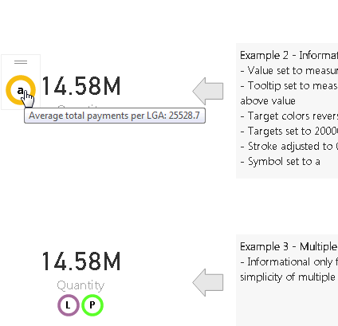

#Info Visual

[Download Info.pbiviz] (https://github.com/aubrianpeters/pbivisuals/raw/master/info/dist/info.pbiviz)

##Purpose
A simple implementation of an info bubble used to hide further information within a report, without taking up excessive space.

##Privacy Policy
Crimson Vault does not collect personally identifiable information about you when you use the info visual.
*Your data is used exclusively for the purposes of displaying the visual within Power Bi.*

##Road Map
1. Implement any changes required for publishing.
2. Implement Tooltip using the powerbi.visuals.tooltips module, or emulating it.

##Licence
See [Licence] (../LICENSE)

##Sample Usage
[Sample] (https://app.powerbi.com/view?r=eyJrIjoiNDhhMzk2M2QtY2UyMi00MzAxLWEzY2YtODM3OWJiMmNlMWVlIiwidCI6ImZiMzllZjkzLWY2OWItNDVmMy1iZTllLTQwYjFjNWEzMzQ0ZSJ9)

##Properties
###Fields
####Value
Used to set value that should determine color for info circle, also used as information tooltip if not tooltip provided.
####Tooltip
Displayed when mouse is over info circle.
####Min
Value for minimum value color, override format => targets => minimum value if provided.
####Mid
Value for middle value color, override format => targets => minimum value if provided.
####Max
Value for maximum value color, override format => targets => minimum value if provided.
###Format
####Targets
#####Minimum Value
Value for minimum value color, if value is at or below this minimum color is used.
#####Minimum Color
Minimum color fill for circle stroke.
#####Middle Value
Value for middle value color.
#####Middle Color
Middle color fill for circle stroke, dithering is used between minimum and maximum values between middle color/value.
#####Maximum Value
Value for maximum value color, if value is at or below this minimum color is used.
#####Maximum Color
Maximum color fill for circle stroke.
####Stroke
#####Stroke Width
How much stroke color should be used between 0 and 1, defaults to 0.2 (20%)
####Symbol
#####Symbol
Character to be used on info bubble, defaults to ?
#####Symbol Color
Color for character to be used on info bubble.

